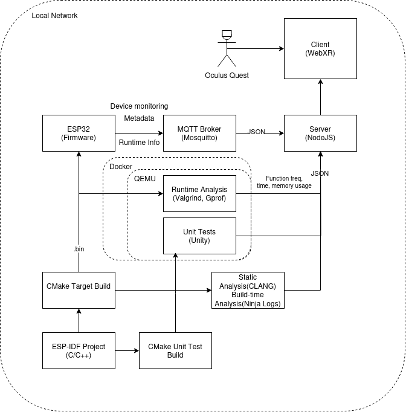

## Intro

An experimental project to explore visualising different layers of an embedded system, it's development, application and network layer using VR system for purposes of testing, debugging or monitoring purposes.

It is difficult to represent and visualise all layers of an implementation on one or two monitors due to space or set-up. Setting up a VR environment and display all relevant data in an environment could prove more inuitive in representing a full system. 

More overhead potentially is required to implement the additional logging features. 

Baseline used for setting up the project:
* VR platform : Oculus Quest 2
* VR visualisation : WebXR - ThreeJS
* Server : NodeJS Express 
* Embedded platform : ESP32/ESP-IDF

### System Architecture
Philosophy of the system is to extract all facets relating to embedded development for visualisation. 
* Attempt to open up and make information packagable from build system to application. 
* Write application and interfacing of embedded components in a logging conscious way.



## Setting up

NodeJS 17 or higher

WebXR requires to run through secure https if not ran through localhost. To run untethered on local server, have to set up self-certified certificates.
Set up certificates in the project dir.

```sh
    openssl genrsa -out server.key 2048
    openssl req -new -key server.key -out server.csr
    openssl x509 -req -days 365 -in server.csr -signkey server.key -out server.cert
```

Running the project
```sh
npm install
npm build
npm run
```
## Acknowledgements

This project uses the `Adafruit HUZZAH32 ESP32 Feather` model, which is made available under the CC-BY-4.0 license.

**Title:** Adafruit HUZZAH32 ESP32 Feather  
**Author:** Jamie Hamel-Smith ([https://sketchfab.com/jamie3d](https://sketchfab.com/jamie3d))